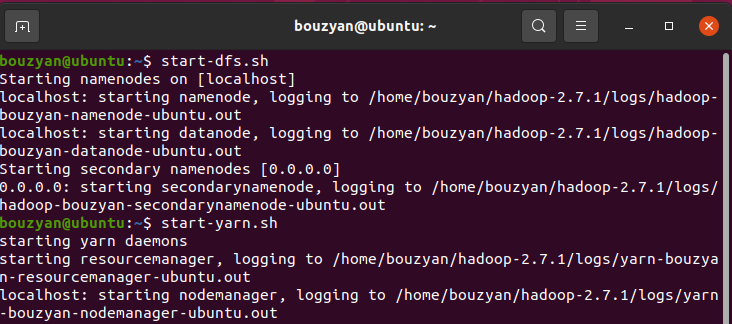
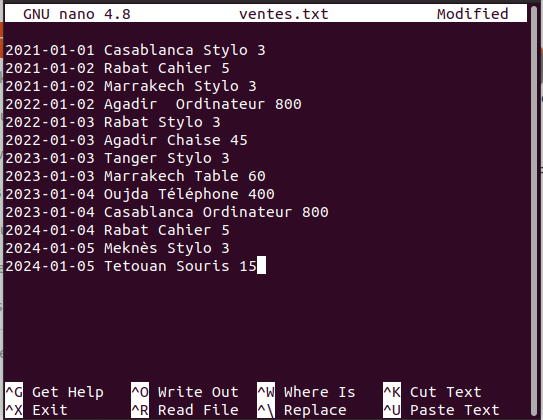
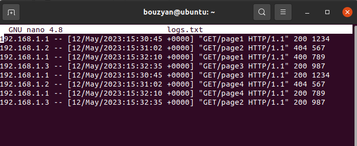
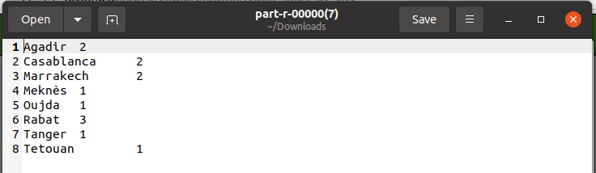
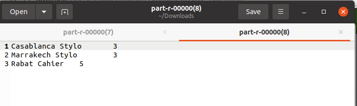
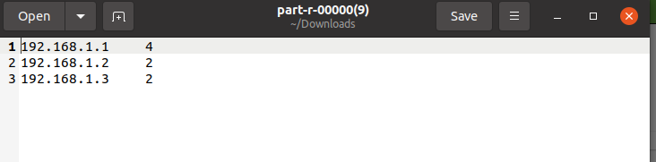
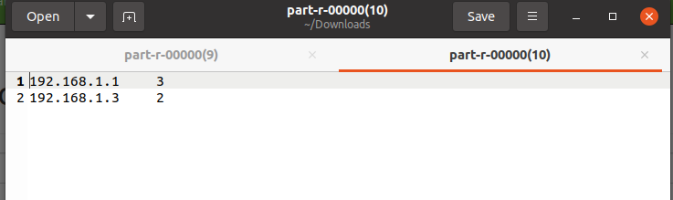

# TP2-Map-Reduce

## Start HDFS service and YARN service
Start the HDFS services and YARN services with the following commands:

`start-dfs.sh`

`start-yarn.sh`



## Check if the services have been started

`jps`


## Executing a Hadoop MapReduce job

To initiate the processing task using our MapReduce framework,  execute the command provided below:

`  hadoop jar $JAR_FILE $MAIN_CLASS $INPUT_PATH $OUTPUT_PATH  `

## Reducer Class 
```java
import org.apache.hadoop.io.IntWritable;
import org.apache.hadoop.io.Text;
import org.apache.hadoop.mapreduce.Reducer;
import java.io.IOException;


public class WordCountReducer extends Reducer<Text , IntWritable , Text , IntWritable >{
    @Override
    protected void reduce(Text key, Iterable<IntWritable> values, Context context) throws IOException, InterruptedException {
        int sum = 0;
        for (IntWritable val : values) {
            sum += val.get();
        }
        context.write(key, new IntWritable(sum));
    }
}

```
## Commands for File Creation, Editing, and HDFS Uploading"

This command creates an empty file named "ventes.txt" if it doesn't already exist

`touch ventes.txt` 

This opens the "ventes.txt" file in the nano text editor, allowing you to edit its contents.

`nano ventes.txt`



This command uploads the local "ventes.txt" file to the root directory of the Hadoop Distributed File System (HDFS).

`hdfs dfs -put ventes.txt /`

We gonna do the same thing with logs.txt 



## Extracts the city from a given input text line and emits a key-value pair of the city and a constant value of one

```java
 private static final IntWritable ONE = new IntWritable(1);
    @Override
    protected void map(LongWritable key, Text value, Context context) throws IOException, InterruptedException {
        String[] fields = value.toString().split(" ");
        if(fields.length > 1) {
            String city = fields[1];
            context.write(new Text(city), ONE);
        }
    }
```


## Calculate the total sales price of products per city
```java
private int targetYear = 2021;
    @Override
    protected void map(LongWritable key, Text value, Context context) throws IOException, InterruptedException {
        String[] fields = value.toString().split(" ");
        if (fields.length == 4) {
            String date = fields[0];
            int year = Integer.parseInt(date.split("-")[0]);
            if (year == targetYear) {
                String city = fields[1];
                String product = fields[2];
                int price = Integer.parseInt(fields[3]);
                Text outputKey = new Text(city + " " + product);
                context.write(outputKey, new IntWritable(price));
            }
        }
    }
```



## find the total number of requests by IP address 
```java
private static final IntWritable ONE = new IntWritable(1);
 @Override
    protected void map(LongWritable key, Text value, Context context) throws IOException, InterruptedException {
        String[] fields = value.toString().split(" ");
        if(fields.length > 1) {
            String adress = fields[0];
            context.write(new Text(adress), ONE);
        }
    }
```



## Determine the number of successful requests (with HTTP response code 200) by IP address
```java
@Override
    protected void map(LongWritable key, Text value, Context context) throws IOException, InterruptedException {
        String[] fields = value.toString().split(" ");
        if(fields.length > 1) {
            int code = Integer.parseInt(fields[6]);
            if (code==200){
                String adress = fields[0];
                context.write(new Text(adress), ONE);
            }
        }
    }
```


